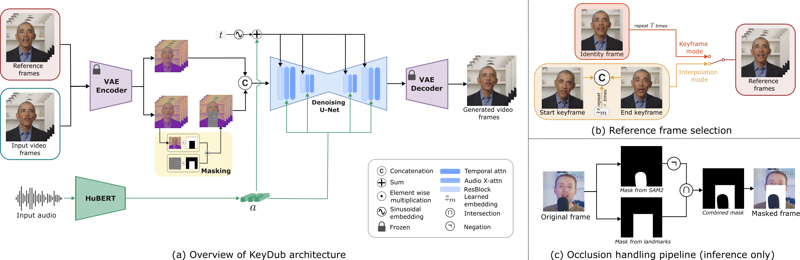

<h1 align="center">KeySync: A Robust Approach for Leakage-free Lip Synchronization in High Resolution</h1>

<div align="center">
    <a href="https://scholar.google.com/citations?user=LuIdiV8AAAAJ" target="_blank">Antoni Bigata</a><sup>1</sup>&emsp;
    <a href="https://scholar.google.com/citations?user=08YfKjcAAAAJ" target="_blank">Rodrigo Mira</a><sup>1</sup>&emsp;
    <a href="https://scholar.google.com/citations?user=zdg4dj0AAAAJ" target="_blank">Stella Bounareli</a><sup>1</sup>&emsp;
    <a href="https://scholar.google.com/citations?user=ty2OYvcAAAAJ" target="_blank">Michał Stypułkowski</a><sup>2</sup>&emsp;
    <a href="https://scholar.google.com/citations?user=WwLpK44AAAAJ" target="_blank">Konstantinos Vougioukas</a><sup>1</sup>&emsp;
    <a href="https://scholar.google.com/citations?user=6v-UKEMAAAAJ" target="_blank">Stavros Petridis</a><sup>1</sup>&emsp;
    <a href="https://scholar.google.com/citations?user=ygpxbK8AAAAJ" target="_blank">Maja Pantic</a><sup>1</sup>
</div>

<br>

<div align="center">
<div class="is-size-5 publication-authors" style="margin-top: 1rem;">
          <span class="author-block"><sup>1</sup>Imperial College London,</span>
          <span class="author-block"><sup>2</sup>University of Wrocław,</span>
</div>
</div>

<br>

<div align="center">
    <a href="https://antonibigata.github.io/KeySync/"></a>
    &nbsp;&nbsp;&nbsp;
    <a href="https://huggingface.co/toninio19/keysync"></a>
    &nbsp;&nbsp;&nbsp;
    <a href="https://huggingface.co/spaces/toninio19/keysync-demo"></a>
    &nbsp;&nbsp;&nbsp;  
    <a href="https://arxiv.org/abs/2505.00497"></a>
</div>

## 📋 Table of Contents
- [Abstract](#abstract)
- [Demo Examples](#demo-examples)
- [Architecture](#architecture)
- [Installation](#installation)
- [Quick Start Guide](#quick-start-guide)
- [Advanced Usage](#advanced-usage)
- [Citation](#citation)
- [Acknowledgements](#acknowledgements)

## Abstract

Lip synchronization, known as the task of aligning lip movements in an existing video with new input audio, is typically framed as a simpler variant of audio-driven facial animation. However, as well as suffering from the usual issues in talking head generation (e.g., temporal consistency), lip synchronization presents significant new challenges such as expression leakage from the input video and facial occlusions, which can severely impact real-world applications like automated dubbing, but are often neglected in existing works. To address these shortcomings, we present
KeySync, a two-stage framework that succeeds in solving the issue of temporal consistency, while also incorporating solutions for leakage and occlusions using a carefully designed masking strategy. We show that KeySync achieves state-of-the-art results in lip reconstruction and cross-synchronization, improving visual quality and reducing expression leakage according to LipLeak, our novel leakage metric. Furthermore, we demonstrate the effectivness of our new masking approach in handling occlusions and validate our architectural choices through several ablation studies.

### Media

<table>
  <tr>
    <td></td>
    <td></td>
    <td></td>
    <td></td>
  </tr>
</table>

For more visualizations, please visit [https://antonibigata.github.io/KeySync/](https://antonibigata.github.io/KeySync/)

### Online Demo

We provide an interactive demo of KeySync at [https://huggingface.co/spaces/toninio19/keysync-demo](https://huggingface.co/spaces/toninio19/keysync-demo) where you can upload your own video and audio files to create synchronized videos. Due to GPU restrictions on Hugging Face Spaces, the demo is limited to processing videos of maximum 6 seconds in length. For longer videos or better performance, we recommend using the inference scripts provided in this repository to run KeySync locally on your own hardware.

## Architecture

<div align="center">
  
</div>

## Installation

### Prerequisites
- CUDA-compatible GPU
- Python 3.11
- Conda package manager

### Setup Environment

```bash
# Create conda environment with necessary dependencies
conda create -n KeySync python=3.11 nvidia::cuda-nvcc conda-forge::ffmpeg -y
conda activate KeySync

# Install requirements
python -m pip install -r requirements.txt --no-deps

# Install PyTorch with CUDA support
python -m pip install torch==2.4.1 torchvision==0.19.1 torchaudio==2.4.1 --index-url https://download.pytorch.org/whl/cu121

# OPTIONAL
git clone https://github.com/facebookresearch/sam2.git && cd sam2

pip install -e . --no-deps
```

### Known Issues

If you encounter synchronization issues between omegaconf and antlr4, you can fix them by running:


```bash
python -m pip uninstall omegaconf antlr4-python3-runtime -y
python -m pip install "omegaconf==2.3.0" "antlr4-python3-runtime==4.9.3"
```


### Download Pretrained Models

```bash
git lfs install
git clone https://huggingface.co/toninio19/keysync pretrained_models
```

## Quick Start Guide

### 1. Data Preparation

To use KeySync with your own data, for simplicity organize your files as follows:
- Place video files (`.mp4`) in the `data/videos/` directory
- Place audio files (`.wav`) in the `data/audios/` directory

Otherwise you need to specify a different video_dir and audio_dir.

### 2. Running Inference

For inference you need to have the audio and video embeddings precomputed.
The simplest way to run inference on your own data is using the `infer_raw.sh` script which will compute those embeddings for you:

```bash
bash scripts/infer_raw_data.sh \
  --filelist "data/videos" \
  --file_list_audio "data/audios" \
  --output_folder "my_animations" \
  --keyframes_ckpt "path/to/keyframes_model.ckpt" \
  --interpolation_ckpt "path/to/interpolation_model.ckpt" \
  --compute_until 45
```

This script handles the entire pipeline:
1. Extracts video embeddings
2. Computes landmarks
3. Computes audio embeddings (using WavLM, and Hubert)
4. Creates a filelist for inference
5. Runs the full animation pipeline

For more control over the inference process, you can directly use the `inference.sh` script:

```bash
bash scripts/inference.sh \
  --output_folder "output_folder_name" \
  --file_list "path/to/filelist.txt" \
  --keyframes_ckpt "path/to/keyframes_model.ckpt" \
  --interpolation_ckpt "path/to/interpolation_model.ckpt" \
  --compute_until "compute_until"
```

or if you need to also save intermediate embeddings for faster recompute

```bash
bash scripts/infer_and_compute_emb.sh \
  --filelist "data/videos" \
  --file_list_audio "data/audios" \
  --output_folder "my_animations" \
  --keyframes_ckpt "path/to/keyframes_model.ckpt" \
  --interpolation_ckpt "path/to/interpolation_model.ckpt" \
  --compute_until 45
```

### 3. Training Your Own Models

The dataloader needs the path to all the videos you want to train on. Then you need to separate the audio and video as follows:
- root_folder:
  - videos: raw videos
  - videos_emb: embedding for your videos
  - audios: raw audios
  - audios_emb: precomputed embeddigns for the audios
  - landmarks_folder: landmarks computed from raw video
  
You can have different folders but make sure to change them in the training scripts.

KeySYnc uses a two-stage model approach. You can train each component separately:

#### KeySync Model Training

```bash
bash train_keyframe.sh path/to/filelist.txt [num_workers] [batch_size] [num_devices]
```

#### Interpolation Model Training

```bash
bash train_interpolation.sh path/to/filelist.txt [num_workers] [batch_size] [num_devices]
```

## Advanced Usage

### Command Line Parameters

| Parameter | Description | Default |
|-----------|-------------|---------|
| `video_dir` | Directory with input videos | `data/videos` |
| `audio_dir` | Directory with input audio files | `data/audios` |
| `output_folder` | Where to save generated animations | - |
| `keyframes_ckpt` | Keyframe model checkpoint path | - |
| `interpolation_ckpt` | Interpolation model checkpoint path | - |
| `compute_until` | Animation length in seconds | 45 |
| `fix_occlusion` | Enable occlusion handling to mask objects that block the face | False |
| `position` | Coordinates of the object to mask in the occlusion pipeline (format: x,y, e.g., "450,450") | None |
| `start_frame` | Frame number where the specified position coordinates apply (using the first frame typically works best) | 0 |

### Advanced Configuration

For more fine-grained control, you can edit the configuration files in the `configs/` directory.

## LipScore Evaluation

KeySync can be evaluated using the LipScore metric available in the `evaluation/` folder. This metric measures the lip synchronization quality between generated and ground truth videos.

To use the LipScore evaluation, you'll need to install the following dependencies:

1. Face detection library: [https://github.com/hhj1897/face_detection](https://github.com/hhj1897/face_detection)
2. Face alignment library: [https://github.com/ibug-group/face_alignment](https://github.com/ibug-group/face_alignment)

Once installed, you can use the LipScore class in `evaluation/lipscore.py` to evaluate your generated animations:


## Citation

If you use KeySync in your research, please cite our paper:

```bibtex
@misc{bigata2025keysyncrobustapproachleakagefree,
      title={KeySync: A Robust Approach for Leakage-free Lip Synchronization in High Resolution}, 
      author={Antoni Bigata and Rodrigo Mira and Stella Bounareli and Michał Stypułkowski and Konstantinos Vougioukas and Stavros Petridis and Maja Pantic},
      year={2025},
      eprint={2505.00497},
      archivePrefix={arXiv},
      primaryClass={cs.CV},
      url={https://arxiv.org/abs/2505.00497}, 
}
```

## Acknowledgements

This project builds upon the foundation provided by [Stability AI's Generative Models](https://github.com/Stability-AI/generative-models). We thank the Stability AI team for their excellent work and for making their code publicly available.
